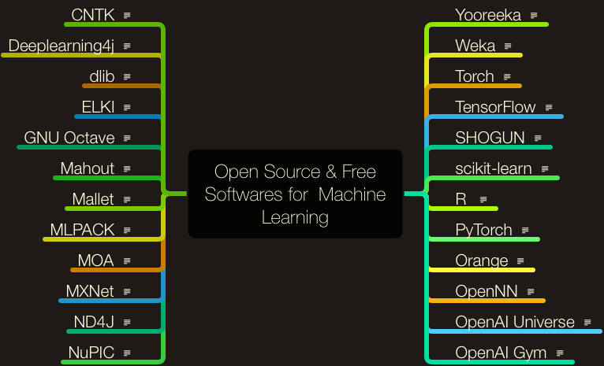
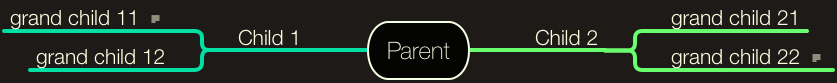

# awesome_machine_learning_visualisations
Repository to easily visualise machine learning tasks, datasets, and tools.


## Table of Contents
* Motivation
* Visualisation
* Data Format
	* TaskPaper format
	* Output image
	* Output MindNode file
* Contributing
	* Step 1: Fork or Clone
	* Step 2: Update
	* Step 3: Create Pull request
* Reference
* Creators
* License

## Motivation
Given the current popularity of machine learning there are hundreds if not thousands of new people entering this field every day. Given machine learning has several applications in various domains, therefore it can be quite difficult for beginners to identify what exactly is the topic which appeals oneself. 

I am big fan of mind mapping tool like [MindNode][]. I wondered if tool like mindnode could be used to create appealing visualisations for understanding broadly machine learning tasks, which motivated me to create this repository. The goal of this repository is to provide a gentle introduction to several machine learning tasks and respective datasets for beginners aspiring to enter this field. 

Since the field is growing enormously which would make it impossible for a single person like me to keep track of several existing tasks and the ones invented with time. Therefore I would request people out there to contribute by keeping this repository a central place to easily visualise several machine learning tasks and its application.

Since MindNode is a paid application, therefore I would be sharing files in simple text format with `.taskpaper` extension for contributors to easily extend the work without a need of buying any new application. While merging any new pull request I will import the `.taskpaper` file in MindNode and generate a new `.png` file. 

## Visualisation
Below is a visualisation for a list open source tools and softwares available for machine learning sorted alphabetically from left to right, top to bottom.
<p align="center">

</p>

## Data Format
### Input: TaskPaper File
This is a simple text file with tab separated nested child values. Once can easily edit the above file in any text editor.

```
Parent:
  Child 2:
		grand child 21:
		grand child 22:
			notes for grand child 22
	Child 1:
		grand child 11:
			notes for grand child 11
		grand child 12:
```

### Output: Image
Below is an image generated as an output of export operation from MindNode application, after giving above input `.taskpaper` file as an input.
<p align="center">

</p>

### Output: MindNode file
Remember I am keeping this mind node file for reference purpose only. Contributors have only to update `.taskpaper` file in a text editor and create a pull request.

```
sample.mindnode
├── QuickLook
│   └── Preview.jpg
├── contents.xml
├── resources
├── style.mindnodestyle
│   ├── contents.xml
│   └── metadata.plist
└── viewState.plist
```

## Contributing
### Step 1
* Option 1
	* Fork this repo.
* Option 2
	* Clone this repo at your local machine using `git clone https://github.com/vijaydaultani/visualisation`

### Step 2
* Open existing file in task paper format, update or add new information for existing tasks.
* If you want to add a new task, altogether create a new file with task paper extension and follow the steps in data format section to edit `.taskpaper` file.

### Step 3
* Create a new pull request.

## Reference
Thanks to below posts, articles and presentations which helped to create this wonderful repository.

* [Connecting the Dot - I, (NLP in Practise)][John Hopkins 1], by Delip Rao
* [Connecting the Dot - II, (NLP in Practise)][John Hopkins 2], by Delip Rao
* Curated list of [Machine Learning Datasets][Wikipedia Datasets] on Wikipedia

## Creators
### Vijay Daultani
* Personal Website: [here][Vijay Website]
* LinkedIn: [here][Vijay LinkedIn]
* Twitter: [here][Vijay Twitter]

## License
See the LICENSE file [here][LICENSE].


[MindNode]: https://mindnode.com/
[John Hopkins 1]: http://www.cs.jhu.edu/~jason/465/PDFSlides/lect-tasks-rao1.pdf
[John Hopkins 2]: http://www.cs.jhu.edu/~jason/465/PDFSlides/lect-tasks-rao2.pdf
[Wikipedia Datasets]: https://en.wikipedia.org/wiki/List_of_datasets_for_machine_learning_research
[Vijay Website]: https://vijaydaultani.github.io/
[Vijay LinkedIn]: https://www.linkedin.com/in/vijaydaultani/
[Vijay Twitter]: https://twitter.com/vijaydaultani
[LICENSE]: https://github.com/vijaydaultani/visualisation/blob/master/LICENSE
